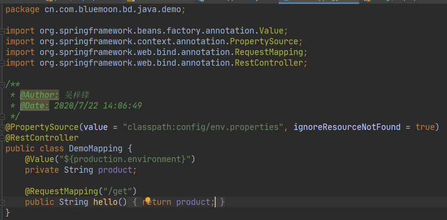
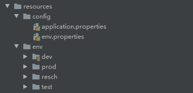
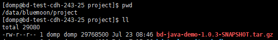
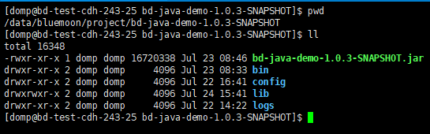
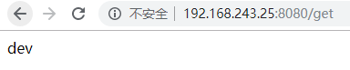

# bd-java-demo

## Java Demo开发，熟悉公司开发、打包、发布、部署流程

### 核心代码

</img>

### 配置信息目录

</img>

### 打包命令
mvn clean package -Dmaven.test.skip=true -P dev|test|prod|resch

### 部署地址
192.168.243.25

### 部署目录

</img>

###工作目录

</img>

#### Bin：存放启动、停止脚本
#### Config：存放配置文件
#### Lib：存放依赖
#### Logs：存放日志

### 开发环境下运行效果

</img>

###生产环境下运行效果
 

</img>

2020/7/24
